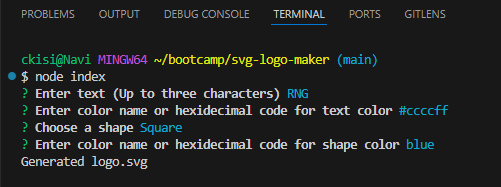

# svg-logo-maker

## Description
This is a SVG logo generator that takes in user input and creates a subsequent logo in SVG format. You can choose the shape as well as the color for both the text and the shape itself.

## Usage
Open the terminal and run "node index". Then fill out the questions; for color questions, you can either enter a color name or a hexidecimal code. When you see "logo.svg created" then the logo will have been generated. It will be in the examples folder, named logo.svg.

## Technologies
- Node.js
- npm Inquirer
- SVG

## Screenshots

## Links
- Repository: https://github.com/ckisi/svg-logo-maker
- Video: https://drive.google.com/file/d/17h3A1BbIvvedo8QrzX-dKR1izWjKweBc/view

## Credits
Xpert Learning Assistant for help with asynchronous code.
